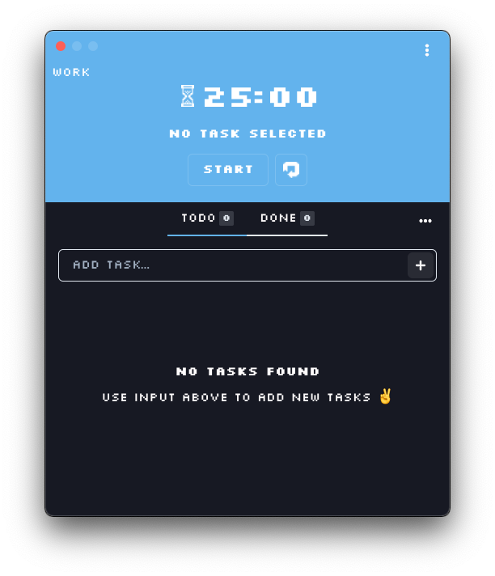
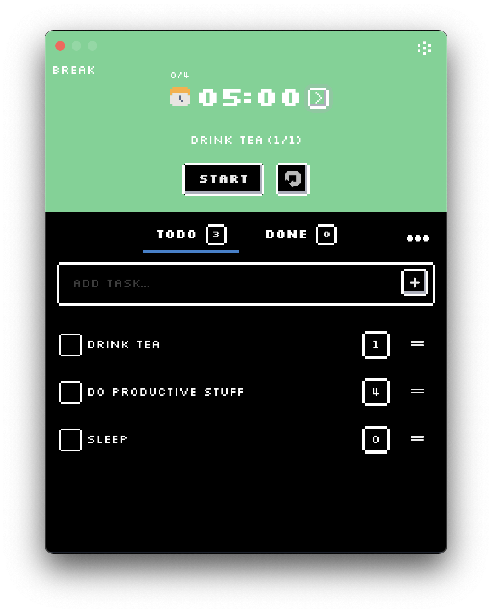
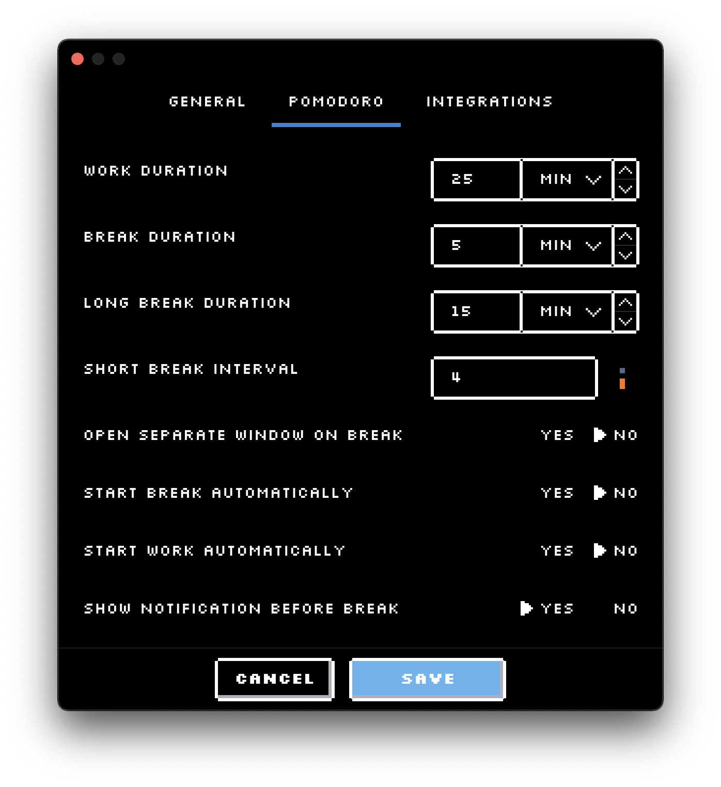

# Pixel Pomodo ⏱

Pixel Pomodo is an app built using React & Electron.

## Overview:

* Pixel-art like ui.
* Tasks list with drag and drop support and pomodoro tracking.
* Customizable session durations.
* Full-screen break overlay (with option to switch it off).
* Dark mode.
* Enable "Do Not Disturb" mode during breaks (currently supported only on MacOS)
* Integration with Trello
* Play 8-bit sound on break/work start 

The app is still in early stage, and I have plans for more features in the future ;).

### Plans for future features:

* Integration with various providers, like Jira etc. with time tracking.
* Time reports
* Break suggestions.
* On full screen break window - show random pixel art animation.
* App icon
* More UI tweaks

### Screenshots

## Development

In order to develop the app run:

* `npm run install` - Installs dependencies
* `npm run watch:electron` - Watches changes made on electron side
* `npm run start:renderer` - To start the renderer on `http://localhost:3000` (via `create-react-app`)
* `npm run start:electron` - Starts the electron app in development mode.

### Testing

#### Unit

In order to execute unit tests run `npm run test`

#### E2E

In order to execute E2E tests (via spectron) make sure that the renderer is running (`npm run start-renderer`) and then run `npm run test:e2e`

> Hint: You can also run the E2E tests in docker via `npm run test:e2e-docker` 

### Lint

To lint the project run `npm run lint`

### Packing

To build and pack the app for your platform:

* `npm run rebuild` - Rebuilds native dependencies for your platform
* `npm run build:all` - Builds renderer and main
* `npm run make` - Creates distributable for your platform

### Releases

Releases are handled via `semantic-release` and are triggered automatically via commits on `master` branch. In order to run release manually run `npm run semantic-release`

> Note: Builds for Apple M1 are being done on my Macbook Pro via a custom github runner, so they are available only when I start the release.

### License

This project is under [MIT License](LICENSE.md).
