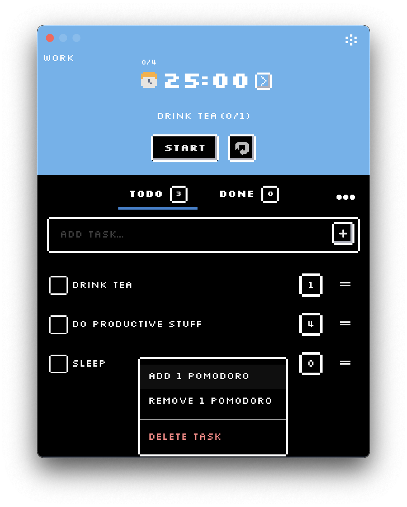

# Pixel Pomodo ⏱

Pixel Pomodo is an app built using React & Electron.

## Features:

* Pixel-art like ui.
* Tasks list with drag and drop support and pomodoro tracking.
* Customizable session durations.
* Full-screen break overlay (with option to switch it off).
* Dark mode.

The app is still in early stage, and I have plans for more features in the future ;).

### Plans for future features:

* Integration with various providers, like Jira, Trello etc. with time tracking.
* Time reports
* Break suggestions.
* Sounds
* On full screen break window - show random pixel art animation.

### Screenshots

### Development

In order to develop the app run:

* `npm run install && npm run install-app-edps` - Installs dependencies for app and for electron-builder
* `npm run watch-electron` - Watches changes made on electron side
* `npm run start-renderer` - To start the renderer on `http://localhost:3000` (via `create-react-app`)
* `npm run start-electron` - Starts the electron app in development mode.

### Testing

#### Unit

In order to execute unit tests run `npm run test`

#### E2E

In order to execute E2E tests (via cypress) make sure that the renderer is running (`npm run start-renderer`) and then run `npm run test:e2e`

> Hint: You can also run the E2E tests in docker via `npm run test:e2e-docker` 

### Lint

To lint the project run `npm run lint`

### Packing

To build and pack the app run:

* For macos build run `npm run build-macos`
* For windows build run `npm run build-windows`

Note: Linux support is planned in the future, feel free to submit PRs!

### Releases

Releases are handled via `semantic-release` and are triggered automatically via commits on `master` branch. In order to run release manually run `npm run semantic-release`

